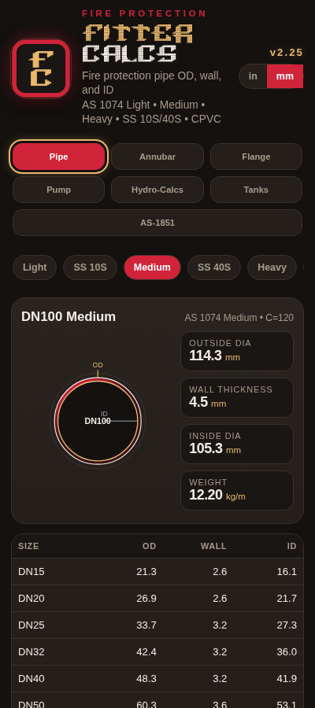
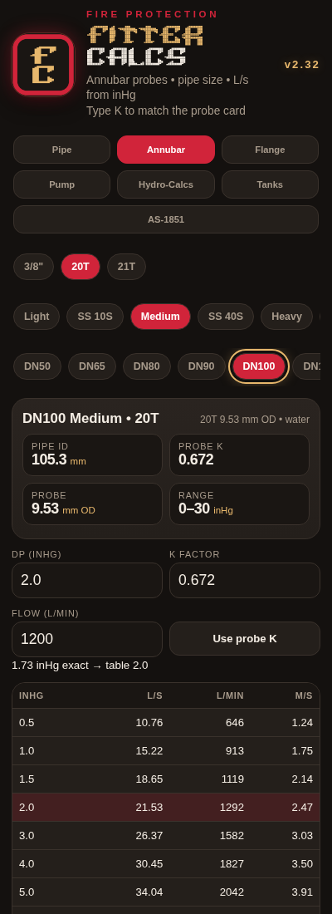
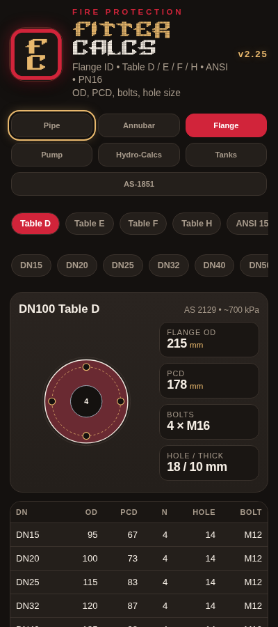
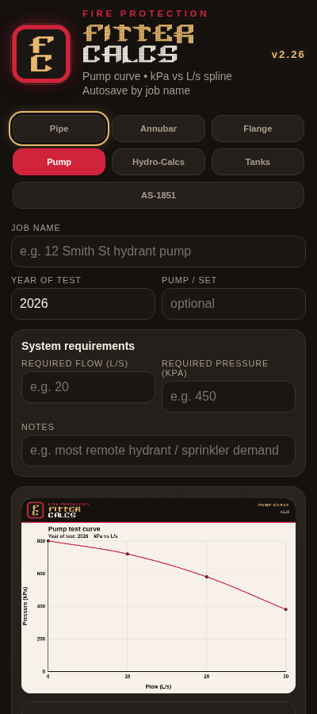
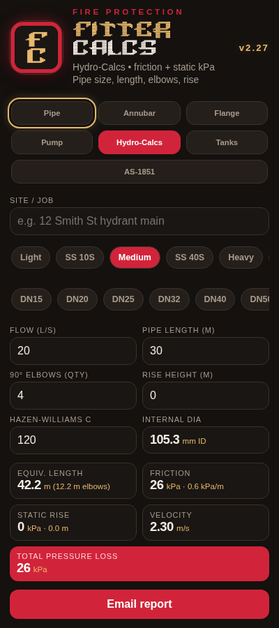
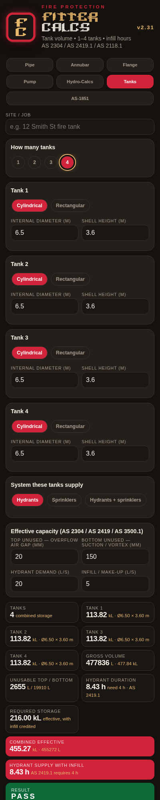

# FitterCalcs

<p align="center">
  
  <br>
  
</p>

<p align="center">
  Field calculator for fire protection fitters.<br>
  AS 1074 pipe sizes, Annubar flow, flanges, pump curves, hydro losses, tanks, and AS 1851 lookup.
</p>

<p align="center">
  <strong>Current version: 2.26</strong><br>
  <a href="https://github.com/macski777/fittercalcs/releases/latest">Download FitterCalcs.apk</a>
</p>

## Logo

The launcher icon and the **FITTER / CALCS** wordmark use **Delta Corps Priest 1** (CoSMiC cHiLD / FIGlet). Body text in the app is the original system sans font.

<p align="center">
  
  &nbsp;&nbsp;
  
</p>

## Install on Android

1. Download [FitterCalcs.apk](https://github.com/macski777/fittercalcs/releases/download/v2.26/FitterCalcs.apk).
2. Open the file on the phone.
3. Allow install from this source if Android asks.
4. Open **FitterCalcs**.

Needs Android 7 or newer.

## Updates

From **2.18** onward the app checks this repo when it opens.

- A red **Update** banner appears when a newer build is online.
- An Android notification is posted as well.
- Tap **Update** to download and install.
- Tap the version number (top right) to check by hand.

Phones on **2.17 or older** need a one-time install of 2.18 or later (USB or this page). After that they update themselves.

## What’s in the app

| Tab | What it does |
| --- | --- |
| **Pipe** | OD, wall, ID for AS 1074 Light / Medium / Heavy, SS 10S, SS 40S, CPVC. mm or inch. |
| **Annubar** | L/s from inHg for 3/8", 20T, and 21T. Medium-steel card K; other walls interpolate by ID. |
| **Flange** | AS 2129 Table D/E/F/H, ANSI 150/300, PN16 — OD, PCD, bolts, holes. |
| **Pump** | kPa vs L/s curve, autosave by job. Email a customer report citing AS 2941 / AS 2419.1 / AS 2118.1 / AS 1851. |
| **Hydro-Calcs** | Hazen-Williams friction + static rise. Email a customer report citing AS 1074 / AS 2118.1 / AS 2419.1. |
| **Tanks** | Cylindrical / rectangular volume, effective kL. Email a customer report citing AS 2304 / AS 2419 / AS 3500.1. |
| **AS-1851** | Field lookup for AS 1851-2012 routine service. Not a substitute for the Standard. |

### Pipe

AS 1074 Light, Medium, and Heavy steel, plus stainless and CPVC. Cross-section, OD / wall / ID, mm or inch.

<p align="center"></p>

### Annubar

3/8", 20T, and 21T. 20T/21T K is from the medium steel card; other walls interpolate by ID.

<p align="center"></p>

### Flange

AS 2129 tables, ANSI, and PN16 — OD, PCD, bolts, hole size.

<p align="center"></p>

### Pump

kPa vs L/s curve, job autosave, large chart. **Email report** sends a customer summary citing AS 2941, AS 2419.1, AS 2118.1 and AS 1851, with the curve attached.

<p align="center"></p>

### Hydro-Calcs

Hazen-Williams friction plus static rise. **Email report** sends a customer summary citing AS 1074, AS 2118.1 and AS 2419.1.

<p align="center"></p>

### Tanks

Cylindrical or rectangular volume, gross and effective kL. **Email report** cites AS 2304, AS 2419.1, AS 2118.1 and AS/NZS 3500.1.

<p align="center"></p>

### Annubar K

- **20T** (single-mount 3/8″) and **21T** (dual-mount 3/8″) use the medium steel card: DN50 **0.638**, DN65 **0.617**, DN80 **0.665**, DN90 **0.661**, DN100 **0.672**, DN125 **0.671**, DN150 **0.706**.
- Light, Heavy, SS 10S, SS 40S (Sch 40 ID), and copper interpolate that K against mill ID. DN200+ holds the DN150 K.
- **3/8″** still uses the Diamond II formula. You can still type a K from another card. **Use probe K** puts the table/formula back.

## Field use

This is a site tool, not a certified hydraulic design or a replacement for mill cut sheets, probe charts, or the current Standard. Confirm before you cut, drill, or sign off a test.

## Publish a new version (maintainer)

Bump `versionName` / `versionCode` in `app/build.gradle` and `APP_VERSION` in the HTML, build the APK, then:

```bash
./publish-update.sh "Short note for the update banner"
```

That updates `update.json`, pushes `main`, and attaches `FitterCalcs.apk` to a GitHub release. Phones on 2.18+ pick it up next time they open the app.
